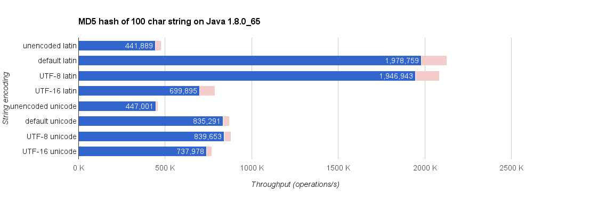
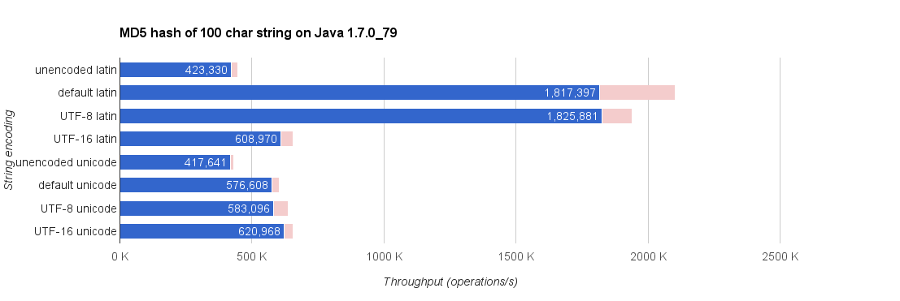

# Task Output Cache

## The project board

See the [ZenHub board](https://github.com/gradle/task-output-cache/issues#boards) for the status of the project. You'll need to have [ZenHub](http://zenhub.com/) installed for your browser. Without the ZenHub extension you'll only see the regular GitHub issues.

## How to try the feature?

We now have [sample scenarios](samples) you can try out. If you want to try the cache on your own projects, you can do so by:

1. Update the wrapper in your Java project to the latest [Gradle nighlty](https://gradle.org/nightly). Make sure you are using the latest version as we are adding new features and fixing bugs every day.
2. Run builds with `./gradlew -Dorg.gradle.cache.tasks=true`

### Local cache backend directory configuration

Task output caching currently works with a local directory as the cache backend. There is no eviction policy, so entries once added to the cache stay there indefinitely. The cache directory by default is in `$GRADLE_HOME/task-cache`. It can be moved to a different location by supplying `-Dorg.gradle.cache.tasks.directory=...`. This can be useful when setting up automated tests for example.

------------------------

## Benchmarks

See [JMH](http://openjdk.java.net/projects/code-tools/jmh/) benchmark sources in the [`benchmark`](./benchmark) project.

### Hash function performances

These are all using Guava's `HashFunction`s:

### Hashing strings

Methods used:

* **unencoded** – `HashFunction.hashUnencodedString(string)`
* **default** `HashFunction.hash(string.getBytes())`
* **UTF-8** `HashFunction.hash(string.getBytes(Charsets.UTF8))`
* **UTF-16** `HashFunction.hash(string.getBytes(Charsets.UTF16))`

The **latin** results used 100 latin letters while **unicode** results used 100 random unicode characters.

