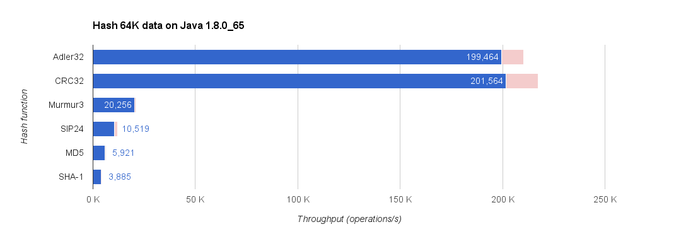

# Benchmarks

These are [JMH](http://openjdk.java.net/projects/code-tools/jmh/) benchmarks to test some low-level aspects of task output caching.

## Hash function performances

These are all using Guava's `HashFunction`s:

## Hashing strings

Methods used:

* **unencoded** – `HashFunction.hashUnencodedString(string)`
* **default** `HashFunction.hash(string.getBytes())`
* **UTF-8** `HashFunction.hash(string.getBytes(Charsets.UTF8))`
* **UTF-16** `HashFunction.hash(string.getBytes(Charsets.UTF16))`

The **latin** results used 100 latin letters while **unicode** results used 100 random unicode characters.

