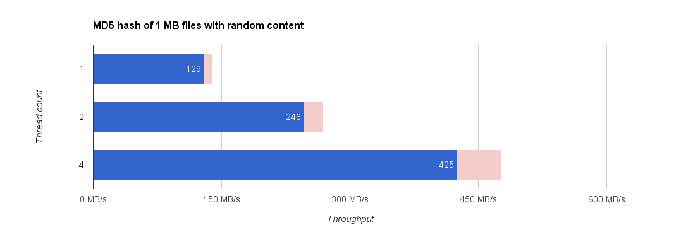

# Benchmarks

These are [JMH](http://openjdk.java.net/projects/code-tools/jmh/) benchmarks to test some low-level aspects of task output caching.

Using MacBook Pro (Retina, 15-inch, Mid 2014):

* Model Name:	MacBook Pro
* Model Identifier:	MacBookPro11,3
* Processor Name:	Intel Core i7
* Processor Speed:	2,5 GHz
* Number of Processors:	1
* Total Number of Cores:	4
* L2 Cache (per Core):	256 KB
* L3 Cache:	6 MB
* Memory:	16 GB

## MD5 on multiple threads

The test is purging the file cache before each iteration by running `sync` and `sudo purge`.

## Hash function performances

These are all using Guava's `HashFunction`s:

## Hashing strings

Methods used:

* **unencoded** – `HashFunction.hashUnencodedString(string)`
* **default** `HashFunction.hash(string.getBytes())`
* **UTF-8** `HashFunction.hash(string.getBytes(Charsets.UTF8))`
* **UTF-16** `HashFunction.hash(string.getBytes(Charsets.UTF16))`

The **latin** results used 100 latin letters while **unicode** results used 100 random unicode characters.

